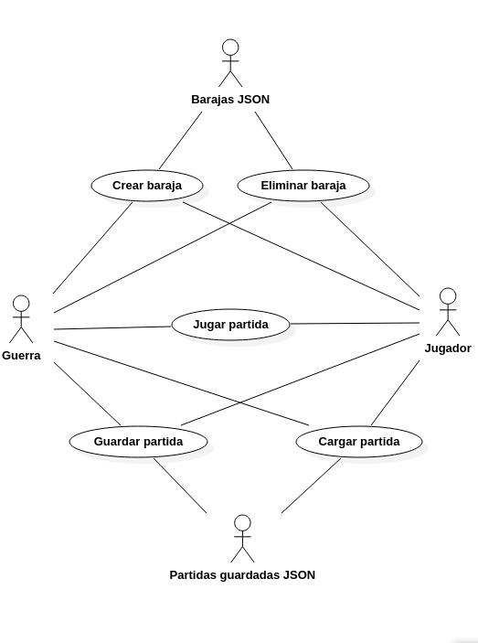
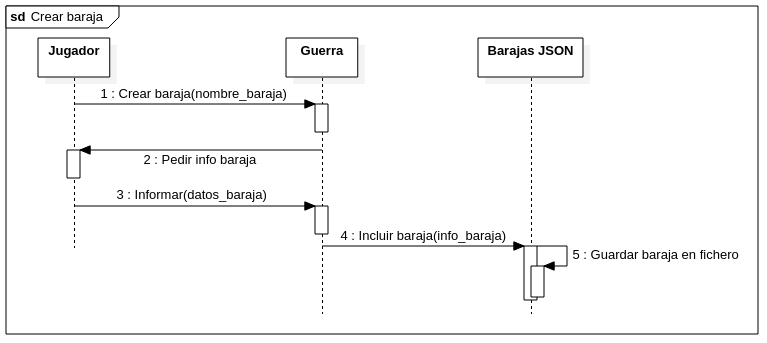
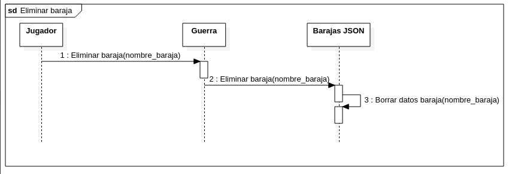
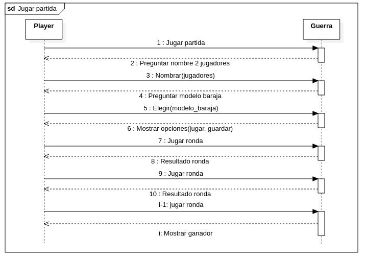
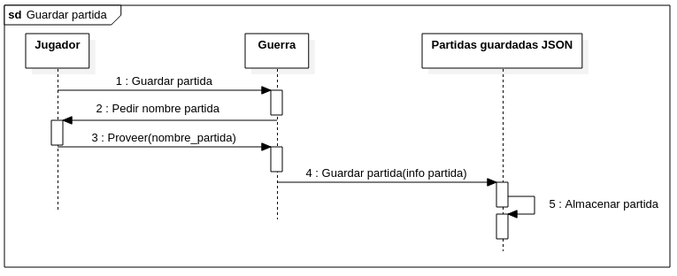
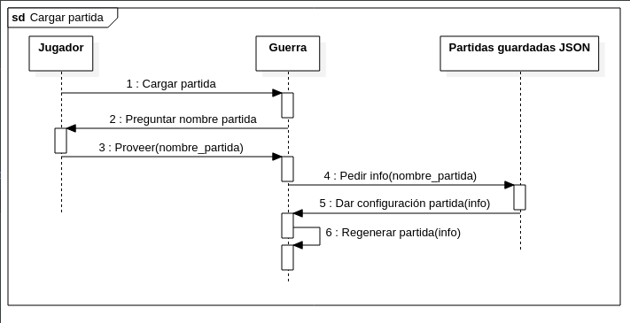
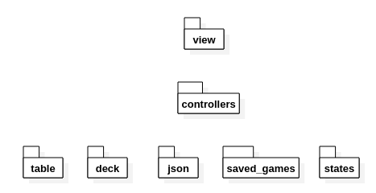
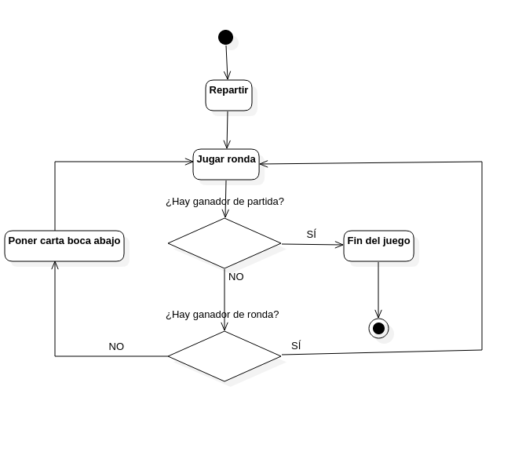

# Proposito de la aplicacion  
Se trata de una aplicacion con fines didacticos, bien para que algun miembro hispanoablante de la comunidad de desarrolladores de C++ pueda encontrar algo de utilidad en ella, <u>bien para que yo la emplee como refresco de memoria en algun momento.</u>  
## Lo que se pretende
Esta aplicacion pretende mostrar un proyecto con una arquitectura concreta (**MVP**) y unas combinaciones de patrones de *dise?o* que pueden ilustrar como conseguir en otros proyectos una gran cohesi?n y un bajo acoplamiento con una granularidad aceptable. Adem?s ilustra el principio de encapsulamiento, la O de los principios SOLID, asi como el resto de estos seis principios.  
Es importante percatarse de como esta arquitectura facilita que se pueda seguir empleando el mismo programa si la interfaz de usuario cambia haciendolo independiente de la misma.  
Ademas, se introduce la libreria **BOOST**, que es sin ninguna duda la librer?a mas importante para el desarrollador estandar de C++ tras la STL. Con Boost se ha llevado a cabo el manejo de archivos **JSON** de este proyecto. De este modo se ejemplifica el uso de JSON a la vez que se usa Boost.  
Tambi?n se han empleado caracteristicas de la STL, en muchas ocasiones sin necesidad, para que resulten didacticas a quien lea el codigo de este programa. 
## Lo que no se pretende
En esta primera version no se pretende que la aplicacion ejempifique el codigo limpio. Para que este codigo fuese limpio requeriria de pruebas automaticas. Algo que al no existir en este momento evitan que se pueda hablar de codigo limpio. Existen, ademas, otros detalles como la falta de rigor con los espacios de nombres.  
No obstante, la arquitectura permite mediante las mismas herramientas de test unitarios hacer tests de "todo" el sistema. Solo hay que dejar la parte de la vista sin probar. 
# Guerra
Se trata de una adaptacion del popular juego de naipes que permite la creacion y destruccion de barajas y cargar y guardar partidas. Esta aplicacion se ejecuta por linea de comandos.    
Si se necesita m?s informaci?n sobre la mecanica que juego [pulse aqui](https://es.wikihow.com/jugar-guerra-(juego-de-cartas)).En esta version la mecanica en caso de empate difiere en que en vez de poner tres cartas boca abajo unicamente se pone una. 
# Dependencias y requisitos
La aplicacion usa C++17 y Boost 1.71.
# Instalacion
Dentro de la carpeta Guerra del proyecto ejecutar lo siguiente:
    
$ mkdir build  
$ cd build  
$ cmake ..  
$ cmake --build .  
# Casos de uso

# Diagramas de secuencia de casos de uso
## Crear baraja

## Eliminar baraja

## Jugar partida

## Guardar partida

## Cargar partida

# Diagrama de paquetes

# Diagrama de estados de una partida

# Descripcion de la arquitectura general del proyecto
El esquema arquitectonico empleado en este proyecto es [MVP (Modelo Vista Presentador)](https://es.wikipedia.org/wiki/Modelo%E2%80%93vista%E2%80%93presentador) y esta intencionadamente exagerado, al emplear clases modelo que podrian evitarse, para cumplir con el proposito didactico de la aplicacion.
# Principales patrones o combinaciones de patrones  
Se emplea especialmente la combinacion **Comando** + **Factoria** + **Peso mosca**. Esta combinaci?n es la base de las vistas. No es evidente por varios motivos:

  * El **Comando** esta modificado para que proporcione una descripcion.
  * Los **Peso mosca** se crean al vuelo cuando se crea la **vista**, que a su vez esta compuesta por una factoria.
  * La **Factoria** no crea objetos. Al estar conformado por punteros compartidos, los comparte.

Es tambien notable el uso del patr?n **Estado**, muy alejado de la forma canonica, que se sustenta en un manejador auxiliar para controlar sus diferentes estados y que adem?s permite la entrada de un argumento. Algo que puede interpretarse como una **Fachada**.  
Si fuera necesario profundizar m?s sobre dichos patrones *Design Patters* del GoF es siempre la mejor referencia.
